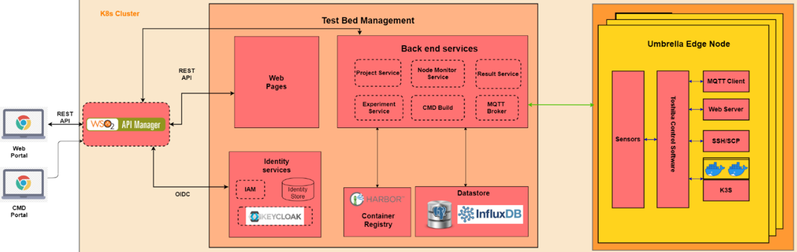

Architecture and Details
************************

Here we provide more details about the architecture and about the testbeds.

Smart City Sensing and Wireless Testbed
=======================================

Three-Tier Architecture
-----------------------

- It is a three-tier architecture consisting of a Backend (servers), an Edge (Small board computers) deployed on the street lamps/citizen houses/buildings and Endpoints (onboard sensors).

Backend Tier
^^^^^^^^^^^^

- Powerful servers with GPU access
- The Umbrella backend and testbed management portal support the various use-cases by providing the standard facilities for users to log in and deploy software (services, firmware and applications) to evaluate experiments that run on the testbed.
- Backend consists of 
  
   - Container registry: The container registry package supports Docker-based container registries through the Harbor server, a key backend component for storing and managing the software relating to different users' projects and experiments.
   - Software deployment on the testbed is achieved using the IoT Kubernetes deployment package based on a lightweight K3S version of the Kubernetes distributed processing framework.
   - The management portal is the main entry point for testbed users to access the testbed and run experiments.
   - The asset management package permits the monitoring and management of the Umbrella system, including all the nodes, software and network interfaces.
   - The analytics package performs functions related to processing and displaying Umbrella system KPIs, API usage/performance and errors, and alerting anomalies.

Edge Tier
^^^^^^^^^

Edge node consists of small board computers (SBC) and an AI node that provides an IoT access point that can house a variety of radios and sensors in stylish, interchangeable modules based on your needs.

- Computing Power
    - All nodes are powered by a Raspberry Pi 3+.
    - Edge-capable nodes are powered further by a Jetson Nano
- Radios
    - Nordic Semiconductor nRF52840 with Power Amplifier – capable of both BLE and 802.15.4 using Contiki-NG
    - Texas Instruments CC1310 – 868MHz long-range radio supported by Contiki-NG
    - HopeRF RFM95W LoRa transceiver
    - RAKwireless RAK2247 LoRaWAN gateway (on selected nodes)
    - GPS receiver for time synchronisation
    - Wi-Fi radio for backbone connectivity
    - 4G cellular dongle for backup connectivity
- Enclosures
    - Equipment is housed in three large and three small diamond-shaped plastic modules. 
    - For new projects, different hardware can be plugged into the modules using USB 2.0. 
- Deployment
    - UMBRELLA nodes can be mounted on posts or walls in many settings, whether roadside on lamp posts, factory walls, or shopping venues.

Endpoint Tier
^^^^^^^^^^^^^

- Sensors
    - Air Quality (VOC Index, Temperature, Humidity, Air Quality Index)
    - Multi-gas (RED, OX, NH3)
    - Particulate (PM2.5, PM10)
    - NO2
    - OX (Oxidising gas for ozone and nitrogen dioxide)
    - Noise (for measuring ambient noise levels)
- Other
    - Sky-facing camera (for use in street light monitoring)

Robotics Testbed
================

- Industrial IoT approach based on the IEC 30141 IoT reference architecture
- Hybrid cloud approach
- Permitting remote access and experimentation
- Using Industrial IoT connectivity standards (REST / DDS)

- The digital twins are simulators and machine learning models representing physical nodes or devices. For instance, robot simulators based on the open source Gazebo or other software platforms.
- The main functions are configuring the simulator or model environment, loading appropriate node software, and running the simulations. Results can then be returned and displayed to the user.
- The Optitrack optical tracking system shall be used for providing ground truth telemetry data for the robot node testbed arenas. The Optitrack system will use Infrared cameras deploying above the test arenas.

Hardware
--------

Each robot is 25cm in diameter and can lift to 4kg individually but can collaborate to tackle larger and heavier payloads.

- Communication and Management Stack

  - Bluetooth 5.0/Wi-Fi (802.11ac)/Ultra-wide Band/(5G in the future)
  - Data Distribution Service (DDS)
  - Support for custom protocol stacks
- Actuation

  - 3 x Omnidirectional wheels
  - Lifter
  - Strain gauges
- GPU
  
  - RockPi 4B based with four onboard cameras
  
- Sensors
  
  - 16 IR Laser time-of-flight distance
  - 9-DoF IMU
  - Ambient temperature, pressure, humidity
  - Robot health (various voltage, current and temperature sensors)

.. image:: _static/Images/0_Introduction/UMBRELLA_Robot.png
  :width: 600
  :alt: UMBRELLA ROBOT

Software architecture
---------------------

- The below diagram presents the overall software architecture of the testbed. One of the key aims is to permit validation of experiment containers on the simulated environment (right side), which is then the containers can be deployed to the actual arena robots (left side).

 .. image:: _static/Images/1_Architecture/Umbrella_robot_software_architecture.png
  :width: 600
  :alt: Robot testbed software architecture

- The deployment is achieved by emulating two interfaces exposed to the containers. 

  - First is the virtual serial ports interface, which is mapped to the real radio interface and redirects the interactions via the radio simulator. 
  - Second, the interactions with the ROS2 hardware interface (left-side diagram) are mapped via the DDS IoT bus (right-side diagram) to the gazebo simulator for the simulated environment models. 
  
- The ROS2 bags and ground truth data are stored locally, which can be visualised or downloaded via the portal. It happens the same way in the real arena robot, but the main difference is obviously in a cloud VM environment.

Software stack layer
^^^^^^^^^^^^^^^^^^^^

The software stack is presented below and relies on integration with DDS and ROS2 to support different APIs (C++, Python and REST API for external application access). 

.. image:: _static/Images/1_Architecture/ROBOT_Software_Stack.png
  :width: 600
  :alt: Software stack layers

Interfaces
^^^^^^^^^^

REST based
""""""""""

Several interfaces are required to facilitate the interaction. The interfaces permit deployment of the experiments, retrieval of data subsequently to the experiment running and the visualisation of, for instance, the simulation or the video camera overlay.

.. image:: _static/Images/1_Architecture/Robot_Interfaces_REST.png
  :width: 600
  :alt: REST Based interfaces

IoT Bus Topics
""""""""""""""

- DDS topics have been defined (primarily based on the ROS2 topics) to support the robots and experiment interactions.
- ROS topic partitions use the prefix `rt/<robot_id>/`.  `robot_id` distinguish between the different robots.

.. image:: _static/Images/1_Architecture/Robot_Interfaces_Bus_Topics.png
  :width: 600
  :alt: REST Based interfaces